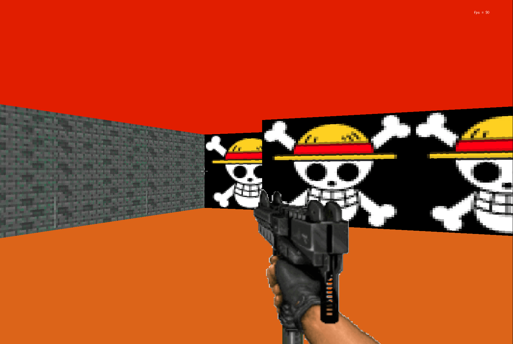
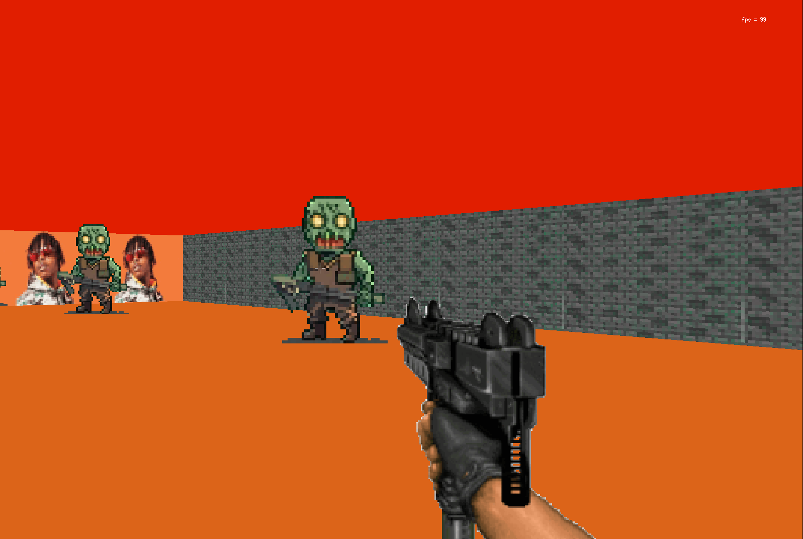

# Cub3D

Cub3D is a 3D raycasting engine inspired by classic games like Wolfenstein 3D. This project recreates a first-person pseudo-3D environment using raycasting techniques. It parses map files (`.cub`), renders textured walls, floors, and ceilings, and includes interactive elements like doors and enemy sprites. Developed as part of the 42 school curriculum, it uses MiniLibX for graphics and handles player movement, mouse-look, and basic shooting mechanics.

## Features

- **Map Parsing**: Supports `.cub` files with textures (NO, SO, EA, WE), floor/ceiling RGB colors, and 2D grid maps.
- **Raycasting Rendering**: Real-time 3D projection with wall textures, doors, and distance-based scaling.
- **Player Controls**: WASD/arrow keys for movement, mouse for camera rotation, spacebar for door interaction, and left-click for shooting enemies.
- **Sprites & Enemies**: Dynamic enemy AI (chasing player), sprite sorting by distance, and crosshair-based shooting.
- **Mini-Map**: Overhead view with player position, walls, and doors.
- **Animations**: Gun firing animation and FPS counter.
- **Docker Support**: Containerized build and run environment for easy setup.
- **Error Handling**: Validates map integrity (walls, player position, doors) and RGB values.

## Screenshots

  
*In-game view with raycasted walls and mini-map*

  
*Crosshair on enemy sprite during combat*

*(Add actual screenshots to the `assets/` folder and update links for your repo.)*

## Installation

### Prerequisites
- Ubuntu 20.04+ (or compatible Linux distro)
- Clang, Make, and X11 libraries

### Manual Setup
1. Clone the repository:
   ```bash
   git clone https://github.com/madamou/cub3d.git
   cd cub3d
   ```

2. Install dependencies:
   ```bash
   sudo apt update
   sudo apt install clang make libx11-dev libbsd-dev libxext-dev
   ```

3. Build the project:
   ```bash
   make all
   ```

### Docker Setup (Recommended for Testing)
1. Ensure Docker and Docker Compose are installed.
2. Build and run:
   ```bash
   docker-compose build
   docker-compose up
   ```
   - This mounts the current directory and forwards X11 for graphics.
   - Run `xhost +local` before starting if needed for X11 access.

## Usage

1. Compile the project (see above).
2. Run with a map file:
   ```bash
   ./cub3D maps/test.cub
   ```
   - Example maps: `maps/test.cub`, `maps/random.cub` (generated via `make random`).

3. Exit: Press **Escape** or close the window.

### Debugging
- **Valgrind**: `make leak` (runs with leak checks).
- **LLDB**: `make debug`.
- **Norminette & Push**: `make push` (formats code and commits).

## Controls

| Key/Mouse          | Action                  |
|--------------------|-------------------------|
| **W/↑ or Z**       | Move forward            |
| **S/↓**            | Move backward           |
| **A/Q or ←**       | Strafe left             |
| **D or →**         | Strafe right            |
| **Mouse**          | Look around (hide with P)|
| **Left Click**     | Shoot (aim at enemies)  |
| **Space**          | Open/Close door (nearby)|
| **Left Shift**     | Speed boost             |
| **P**              | Toggle mouse cursor     |
| **N**              | Delete all sprites (debug)|
| **Escape**         | Quit                    |

## Project Structure

```
cub3d/
├── Dockerfile          # Docker image for build
├── docker-compose.yml  # Docker Compose setup
├── Makefile            # Build script (includes libft & minilibx)
├── includes/           # Header files (cube3D.h, parsing.h, etc.)
├── libft/              # Custom libc implementation
├── maps/               # Example .cub maps (test.cub, random.cub)
├── assets/             # Textures & sprites (walls, gun, enemies)
├── minilibx-linux/     # MiniLibX graphics library
└── srcs/               # Source code
    ├── main.c          # Entry point
    ├── parsing/        # Map parsing & validation
    ├── raycasting/     # Raycasting engine & DDA algorithm
    ├── mlx/            # MiniLibX hooks, rendering, & events
    └── utils/          # Utilities (libft extensions)
```

## Technologies & Dependencies

- **Language**: C (ANSI C89 compliant)
- **Graphics**: MiniLibX (X11-based)
- **Libraries**: Custom `libft` (string/memory utils, printf, GNL)
- **Build Tool**: GNU Make
- **Container**: Docker
- **Compiler**: Clang with `-Wall -Wextra -Werror -g3`

No external dependencies beyond system libs (libX11, libbsd).

## Compilation Flags

- **Standard**: `-Wall -Wextra -Werror -g3`
- **Optimization**: Uncomment `-O3 -Ofast` in Makefile for faster builds.
- **Dependencies**: Links libft, MiniLibX, libm, libX11, libXext.

## Potential Issues & Troubleshooting

- **X11 Errors**: Run `xhost +local` for Docker/X11 forwarding.
- **Map Parsing Errors**: Ensure `.cub` files have valid format (textures before map, single player 'N/S/E/W').
- **No Graphics**: Verify X11 setup (`echo $DISPLAY` should output `:0` or similar).

## Contributing

1. Fork the repo.
2. Create a feature branch (`git checkout -b feature/amazing-feature`).
3. Commit changes (`git commit -m 'Add amazing feature'`).
4. Push to branch (`git push origin feature/amazing-feature`).
5. Open a Pull Request.

Follow 42's norminette for code style (`make form` to auto-format).

## Credits

- **Author**:  pepedinho and judananaa (42 Paris student)
- **Inspiration**: 42 School's Cub3D project
- **Libraries**: MiniLibX (by 42), custom libft
- **Assets**: Custom textures in `assets/` (replace with your own for originality)

---

*Last updated: October 2025*  
Questions? Open an issue or contact itahri@student.42.fr/ madamou@student.42.fr  🚀
